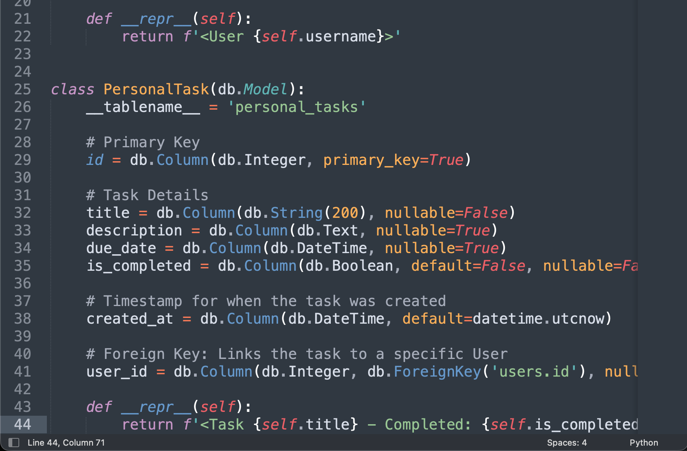

# Project Update: Sprint 2 Completion - GradeSyncr

## 1. Product Backlog Summary
For Sprint 2, the primary objective was to enhance the "Personal Tasks" functionality of GradeSyncr, ensuring students can manage custom tasks alongside their synced Canvas data.

### Successfully Delivered in Sprint 2:
* **Add/Delete Functionality:** Built and integrated a modal interface for adding new personal tasks and deleting obsolete ones.
* **Completion Toggle Logic:** Implemented the backend and frontend logic to mark tasks as "Complete." This is handled locally within the GradeSyncr database to ensure no unauthorized data is pushed back to the Canvas API.
* **Database Integration:** Successfully linked the CRUD operations to the Custom Task Model (user_id, title, description, due_date, is_completed) established in Sprint 1.

### Evidence of Completion

---
## 2. Product Burn-down Chart
The progress of the GradeSyncr backlog is tracked in the Google Sheet linked below. [cite_start]It currently reflects our starting backlog of 8 story points and the successful "burn" down to 1 remaining point following the completion of Sprint 2.

**Link to Google Sheet:** https://docs.google.com/spreadsheets/d/1isldy5DXBXPEc9qnia7gaqeI41UpXxK4pImRcmuHu1U/edit?usp=sharing
*Note: Permissions have been set to "Viewer" for brooksc@mail.wou.edu.*

---
## 3. Personal Project Retrospective
Journal Entry - March 2024

### What went well during this sprint?
The implementation of the CRUD operations for the Custom Task Model was easier than I had anticipated. By implementing the "Add/Delete" modal at the beginning of the sprint, I was able to allocate more time to refine the user interface to ensure that it feels like a native part of the GradeSyncr dashboard. The fact that I was able to differentiate between "Personal Tasks" and "Canvas Assignments" in the backend is a major achievement, as it maintains a clean user state while preventing unauthorized attempts to push "Complete" updates back to the read-only Canvas API.

### What challenges did I face?
The biggest challenge I encountered was state management. Initially, I had encountered an issue where I had toggled a task as "Complete," but it didn't update the dashboard unless I refreshed the page. I had envisioned a more seamless user interface as outlined in my "Outcome Vision." I had to allocate additional time to implement a more reactive frontend update that allows for strike-through of the task as soon as it is marked as complete. I had not anticipated this as a challenge during Sprint 1, which cost me a day of development time that I had not allocated for.

#### Lessons Learned & Future Adjustments
Start with the "Why": I have come to appreciate that differentiating between "Personal Tasks" and "Canvas Assignments" is a major advantage that GradeSyncr offers students. I should have started this earlier during Sprint 1.

Stop Over-Engineering: I had over-engineered the animation of the modal by spending a lot of time trying to make it perfect when a standard animation is enough. In retrospect, I should have started with a more basic implementation and left it until the very end of the project.

Continue Modular Design: I had decided to break down the Task Model into its own database table. I believe that it makes more sense to make the application more scalable in case I want to add "Notes" or "Study Reminders" later.
